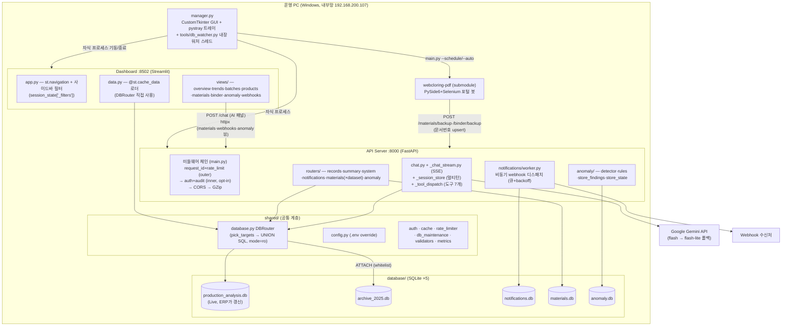
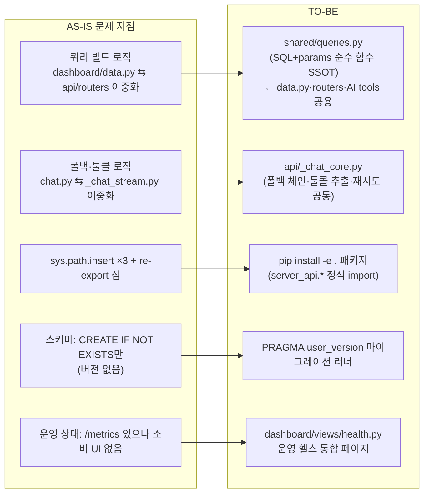
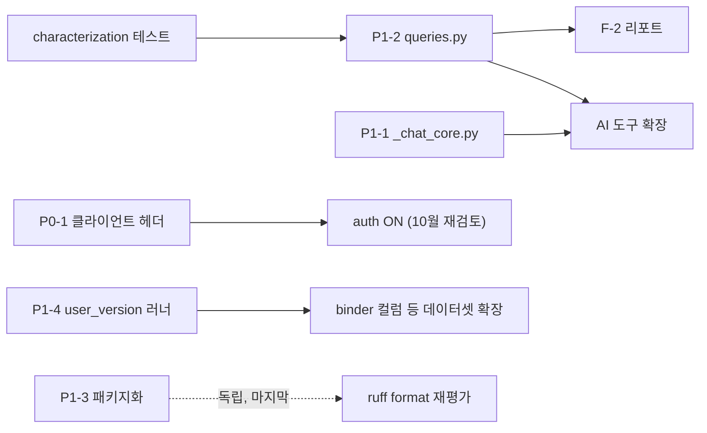

# Server_API (Production Data Hub) 설계 문서

> **상태: ✅ 완료 반영** (2026-07-15) — P0-1 설계가 04 지시서로 구현되어 `main`(bbcbe99) 배포. 나머지 설계 항목(P1-1~P1-5, F-1, F-2)은 로드맵 후속 대기.

> 분석일: 2026-07-12 · 대상: `C:\X\Server_API`
> 전제: `01-improvement-plan.md`의 과제 중 설계가 필요한 항목(P0-1, P1-1~P1-5, F-1, F-2)의 상세 설계.
> 모든 다이어그램은 실제 코드에서 확인한 구조 기준이다.

---

## 1. 현재 아키텍처

### 1.1 시스템 구성 (실코드 기준)



### 1.2 핵심 설계 특성 (변경 시 존중해야 하는 것)

| 특성 | 구현 | 근거 파일 |
|------|------|-----------|
| 대시보드-DB **직접 접근** (API 비경유) | 장애 격리: API 다운 시에도 조회/차트 정상. 챗·webhook 관리·자재 뷰만 HTTP | `docs/specs/system_architecture.md` §4, `dashboard/data.py` |
| 듀얼 DB 라우팅 | `DBRouter.pick_targets(date_from, date_to_exclusive)` → `DBTargets(use_archive, use_live)` → UNION ALL + `source` 컬럼 (커서 안정성) | `shared/database.py:82~121` |
| 읽기 전용 원칙 | 생산 DB 연결은 `mode=ro` URI. 쓰기는 별도 DB(notifications/materials/anomaly)의 store 모듈만 | `shared/database.py:159`, 각 store |
| mtime 캐시 무효화 | ERP가 DB 파일을 통째로 교체 → thread-local 연결 + `db_mtime` 키로 자동 재연결/캐시 무효화 | `shared/_db_connection.py`, `shared/cache.py` |
| 미들웨어 순서 | Starlette는 나중 등록이 outermost — request_id/rate_limit이 밖, auth/audit이 안 (audit이 request_id 참조 가능) | `api/main.py:104~112` 주석 |
| 데이터셋 레지스트리 | `DATASETS` dict 한 줄 추가 = 테이블 쌍 + 라우터 prefix + 봇 키워드 매핑 생성 | `api/materials/datasets.py` |
| 인증 opt-in | `API_AUTH_ENABLED=false` 기본. 활성 시 X-API-Key/Bearer, PUBLIC_PATHS 예외, 상수시간 비교, 감사 로그 | `shared/auth.py`, `api/_audit.py` |

### 1.3 데이터 흐름 요약

1. **조회**: 사이드바 필터 → `session_state["_filters"]` → `data.py` 로더(`@st.cache_data`, db_ver=mtime) → DBRouter UNION SQL → pandas → views 렌더.
2. **AI 챗**: 대시보드 AI 패널 → `POST /chat/`(또는 `/chat/stream` SSE) → 세션 이력 로드 → Gemini 도구 호출 루프(`_tool_dispatch.PRODUCTION_TOOLS`) → DBRouter(ro) → 응답(+`model_used`, `tools_used`).
3. **자재/바인더**: 봇 종료 시 `POST /{prefix}/backup` upsert → materials.db → 대시보드 `dataset_page.py`가 httpx로 조회(`_headers()`에 API 키 지원 이미 존재).
4. **이상탐지**: 주기 스캔(read-only) → rules 판정 → 쿨다운 상태 파일 → 신규만 `emit_event` → webhook worker 발행 + findings DB 기록 → anomaly 대시보드 페이지.

---

## 2. 목표 아키텍처

구조 전환(마이크로서비스·API 일원화·DB 교체)은 **하지 않는다** — 단일 운영 PC + 운영자 1인
전제에서 현 구조가 옳다는 자체 결정(`system_architecture.md` §4.4, roadmap Out of Scope)을 존중한다.
목표는 **같은 토폴로지 안에서 중복 소거 + SSOT 강화 + 관측 표면 추가**다.



---

## 3. 주요 개선 항목별 상세 설계

### 3.1 P1-2 공용 쿼리 서비스 계층 — `shared/queries.py`

**문제**: `dashboard/data.py:load_monthly_summary/load_daily_summary/load_weekly_summary`(204~312행)는
날짜 WHERE 조립 → `pick_targets` → `build_aggregation_sql` → `build_query_params`의 동일 골격을
3벌 복사했고, `api/routers/summary.py`에도 유사 조립이 있다. 주 경계 규칙 불일치 버그를 이미
한 번 겪었다(`data.py:296~298` 주석).

**설계** — 렌더·캐시·HTTP와 무관한 **순수 함수 모듈** (Streamlit/FastAPI import 금지 → 커버리지 측정 대상):

```python
# shared/queries.py (신규)
@dataclass(frozen=True)
class BuiltQuery:
    sql: str
    params: list          # build_query_params 적용 완료본
    use_archive: bool     # get_connection(use_archive=...)에 그대로 전달

def records_query(item_codes, keyword, date_from, date_to, limit,
                  *, cursor=None) -> BuiltQuery: ...
def period_summary_query(bucket: Literal["day", "week", "month"],
                         date_from, date_to, *, item_codes=None) -> BuiltQuery: ...
def top_items_query(date_from, date_to, n: int) -> BuiltQuery: ...
```

- `bucket` 파라미터 하나로 일/주/월 통합 — 주 경계 표현식 `strftime('%Y-W%W', ...)`이 단일 지점이 된다.
- **호출부 변경**: `dashboard/data.py` 로더는 `BuiltQuery`를 받아 `pd.read_sql(q.sql, conn, params=q.params)`만 수행
  (`@st.cache_data`/TTL은 data.py에 잔류 — 캐시는 소비자 관심사). `api/routers/summary.py`·`records.py`,
  `api/tools/summary.py`도 동일 함수 사용.
- **인터페이스 불변**: HTTP 응답 스키마·대시보드 화면·AI 도구 시그니처 변경 없음. 순수 내부 통합.
- **테스트**: 기존 `test_routers_db.py`·`test_ai_tools_db.py`가 회귀 가드. `queries.py` 자체는
  SQL 문자열/파라미터 characterization 테스트 신설(기존 출력 캡처 → 동일성 검증 → 이후 리팩터).

**단계**: ① 기존 4곳 출력의 characterization 테스트 작성 → ② `queries.py` 추출(로직 1:1) →
③ 호출부를 하나씩 교체(커밋 분리) → ④ coverage omit에서 해당 없음(신규 파일은 처음부터 측정).

### 3.2 P1-1 chat/stream 공통 코어 — `api/_chat_core.py`

**문제**: 폴백 판정(`is_fallbackable`), 모델 체인(`GEMINI_MODEL → GEMINI_FALLBACK_MODEL`),
재시도(백오프+지터, `RETRYABLE_STATUS_CODES`), 툴콜 추출이 `api/chat.py`(논스트리밍)와
`api/_chat_stream.py`(`_open_model_stream`, `_tool_calls_from_chunk`)에 따로 산다.

**설계**:

```python
# api/_chat_core.py (신규)
@dataclass(frozen=True)
class ModelAttempt:
    model: str
    is_fallback: bool

def model_chain() -> list[ModelAttempt]:
    """GEMINI_MODEL + (enabled면) GEMINI_FALLBACK_MODEL 순서 결정 — 유일 지점."""

def should_retry(exc, attempt: int) -> tuple[bool, float]:
    """재시도 여부 + 대기시간(백오프+지터). 429/500/503 판정 SSOT."""

def extract_tool_calls(part_or_chunk) -> list[tuple[str, dict]]:
    """response part(논스트리밍)와 stream chunk(스트리밍) 공용 툴콜 추출."""
```

- 전송 계층(요청 1회 vs SSE 청크 순회)은 각 파일에 남긴다 — 통합 대상은 **정책**이지 IO 루프가 아니다.
- 재수출 심 주의: `api/chat.py`가 `_sessions` 등을 re-export(63~71행)하는 관례가 있으므로,
  기존 테스트가 참조하는 이름은 유지한 채 내부 구현만 위임.
- **착수 트리거**(로드맵 A-7 조건 준수): Gemini 모델 세대 교체 또는 폴백 정책 변경 요구가 발생하는
  사이클의 **1번째 커밋**으로 수행.

### 3.3 P0-1 인증 활성화 경로 (auth-enable-v2)

**현황**: 서버 측은 완성(`shared/auth.py` 상수시간 비교 + `PUBLIC_PATHS` SSOT + `api/_audit.py`).
클라이언트 측은 `dashboard/dataset_page.py:_headers()`만 `MATERIALS_API_KEY`/`DASHBOARD_API_KEY`
환경변수를 지원하고, `webhook_admin/api_client.py`·`ai_section.py`(챗 호출)는 무헤더.

**설계** — 공용 헤더 헬퍼로 정렬:

```python
# shared/api_client.py (신규, 소형)
def auth_headers() -> dict[str, str]:
    """DASHBOARD_API_KEY 있으면 {'X-API-Key': ...}, 없으면 {}.
    auth 비활성 서버에는 무해(무시됨) — 항상 붙여도 안전."""
```

- 적용 지점: `dashboard/components/webhook_admin/api_client.py`(전 요청),
  `dashboard/components/ai_section.py`(chat POST/stream), `dashboard/dataset_page.py`(기존 `_headers()`를 위임으로 교체).
- 봇 측: `webcloring-pdf` `ApiBackupManager`의 backup POST에 동일 키 헤더 옵션(.env `SERVER_API_KEY`) — 별도 repo이므로 서브모듈 사이클로 분리.
- **전환 시퀀스** (무중단, 각 단계 롤백 = 직전 단계):
  1. 클라이언트 전부 헤더 지원 배포 (서버 auth OFF — 헤더는 무시되므로 무위험)
  2. 운영 `.env`에 키 발급: `API_KEYS=<random 32B>` + 대시보드/봇 `.env`에 동일 키
  3. `API_AUTH_ENABLED=true` + 매니저 재시작 → `/healthz`(public)와 `/records`(키 필요) 확인
  4. 실패 시 롤백: `API_AUTH_ENABLED=false` 한 줄
- **감사 확인**: 전환 직후 `_audit` 로그에서 401 발생원(빠뜨린 클라이언트) 식별 가능 — 이것이 이 설계의 안전망.

### 3.4 P1-3 패키지화

**설계**:

```toml
# pyproject.toml 추가
[project]
name = "server-api"
version = "11.0.0"          # README 버전 이력의 v11과 동기
requires-python = ">=3.12"
# dependencies는 requirements.txt 참조 관례 유지(dynamic) 또는 이관

[tool.setuptools]
packages = ["api", "shared", "dashboard", "tools"]
```

- 설치: `pip install -e .` 를 `install.bat`/`update.bat`에 한 줄 추가.
- 제거 대상: `api/main.py:14`, `dashboard/app.py:20`, `manager.py:25`의 `sys.path.insert`,
  `tests/conftest.py`의 경로 부트스트랩.
- 함께 청산: `api/main.py:39~43`(`_normalize_date` 등 re-export — 테스트를 `api._http_helpers` 직접 import로 수정),
  `api/chat.py:63~71`(세션 스토어 re-export — 테스트를 `api._session_store`로).
- **리스크**: Streamlit은 `streamlit run dashboard/app.py` 파일 실행이라 `dashboard` 내부의
  상대 import(`from components import ...`, `app.py:22`)가 스크립트 경로 기준 — 이 부분은
  `dashboard/` 디렉토리 sys.path 의존이 잔존할 수 있다. 1차 범위는 `api`/`shared`/`tools`만
  패키지화하고 dashboard 내부 import는 현행 유지(부분 적용 허용)로 리스크를 줄인다.

### 3.5 P1-4 스키마 버전 관리 (경량 마이그레이션 러너)

Alembic은 과설계. SQLite `PRAGMA user_version` 기반 수십 줄 러너:

```python
# shared/schema.py (신규)
Migration = tuple[int, str, Callable[[sqlite3.Connection], None]]
def apply_migrations(conn, migrations: list[Migration], *, logger) -> int:
    """user_version < n인 마이그레이션을 트랜잭션으로 순차 적용."""
```

- 각 store(`api/materials/store.py`, `api/notifications/_store_connection.py`,
  `api/anomaly/store_findings.py`)의 현행 `CREATE TABLE IF NOT EXISTS` 블록을 migration #1로 이관
  (기존 DB는 스키마 동일 확인 후 `user_version=1` 스탬프 — 멱등).
- 데이터셋 레지스트리와 결합: `Dataset`별 테이블 생성도 러너 경유 → binder 전용 컬럼 추가(roadmap B-4)가
  migration #2 한 항목으로 처리된다.
- 백업 연동: 마이그레이션 적용 전 해당 DB 파일 사본(`tools/backup_db.py` 함수 재사용) — 자동 롤백 소재.

### 3.6 F-1 운영 헬스 통합 페이지 — `dashboard/views/health.py`

**데이터 소스는 전부 기존 존재** (신규 수집 없음):

| 표시 항목 | 소스 |
|-----------|------|
| webhook 성공/실패율·큐 깊이·dead-letter | `GET /metrics` (`api/notifications/metrics.py`) |
| rate limiter 현황 | `/metrics` 게이지 |
| DB watcher 마지막 체크/인덱스 복구 이력 | `database/.watcher_state.json` (`tools/watcher.py` load_state) |
| 인덱스 6종 존재 여부 | `shared/db_maintenance.REQUIRED_INDEXES` 대조 (ro 연결) |
| 백업 최신성 (Live 30개·Archive 12개 정책) | `database/backups/` 파일 mtime |
| anomaly 마지막 스캔/쿨다운 활성 수 | `database/.anomaly_state.json` (`api/anomaly/store_state.py`) |
| DB 파일 크기 추이 | `os.path.getsize` ×5 파일 |

- 구성: 상단 상태 배지 행(정상/경고) → 섹션별 expander. 임계 판정(예: 백업 24h 초과 = 경고)은
  순수 함수 `health_checks.py`로 분리해 단위 테스트 + coverage 측정 대상으로.
- `app.py` 내비게이션 "운영" 그룹에 `st.Page("views/health.py")` 한 줄 추가.

### 3.7 F-2 정기 리포트 자동 발행 (개요 설계)

- **트리거**: `tools/watcher.py` 데몬 루프에 "매주 월요일 첫 체크 시" 훅 (신규 스케줄러 프로세스 금지 —
  운영 프로세스 수를 늘리지 않는다).
- **생성**: `shared/queries.py`(3.1)의 `period_summary_query`·`top_items_query` 재사용 →
  `dashboard/data.py:to_excel_bytes` 계열 재사용 → `reports/YYYY-WW.xlsx` 저장.
- **알림**: `api/notifications/events.py:emit_event("report.generated", …)` — 기존 webhook 채널로 통지.
- **의존성 주의**: watcher가 openpyxl에 의존하게 됨 — `requirements-smoke.txt` 경로(최소 API 검증)에는
  불포함 유지, 리포트 생성만 지연 import.

### 3.8 P1-5 아카이브 컷오버 자동 점검

- `tools/watcher.py` 데몬 루프에 검사 1개 추가:
  `date.today().year != ARCHIVE_CUTOFF_YEAR` 이면 하루 1회 `emit_event("maintenance.cutoff_due", …)` + WARNING 로그.
- 실행 자체(`scripts/archive_cutoff.py` — dry-run 지원 321줄)는 수동 유지: 연 1회 작업의 자동 실행은
  리스크 > 이득 (roadmap C-3 착수 기준과 일치). **잊지 않게 하는 것**까지만 자동화.

---

## 4. 마이그레이션 전략과 리스크

### 4.1 공통 원칙 (기존 관례 준수)

- 모든 변경은 기존 게이트 통과가 완료 조건: 전체 pytest(≈630) + ruff(F/BLE001/I/UP/B/SIM/E501) +
  C901 잠금 3파일 + CI coverage floor 88 (`roadmap-2026h2.plan.md` §3.4).
- 커밋은 논리 레이어별 분리, "characterization 테스트 먼저 → 로직 1:1 이동 → 호출부 교체" 순서
  (coverage-blindspots-v1의 `_parsing.py` 추출 선례).
- 운영 배포는 "update.bat + 매니저 재시작" 단일 절차 유지. 이를 깨는 변경(신규 의존성, 스키마
  마이그레이션 포함 릴리스)은 plan 문서에 배포 절차 섹션 필수.

### 4.2 순서와 의존 관계



- P1-3(패키지화)은 blame·import 경로를 광범위하게 건드리므로 **다른 리팩터와 같은 사이클에 두지 않는다**.
  ruff format 재평가(A-8)를 같은 시점에 묶어 blame 단절을 1회로 한정.

### 4.3 리스크 표

| 리스크 | 영향 | 완화 |
|--------|------|------|
| queries.py 추출 중 SQL 미세 차이(정렬·경계)로 화면 수치 변화 | High (운영 대시보드는 라이브 실데이터) | characterization 테스트로 SQL 문자열+params 동일성 선검증. **라이브 환경에서 변경성 기능 테스트 금지** — 빈 fixture DB(CI와 동일 스키마)로 검증 |
| 인증 전환 시 누락 클라이언트 401 → 봇 백업 조업 중단 | High | 3.3 시퀀스(클라 선배포→키 배포→서버 활성). `_audit` 로그로 누락원 즉시 식별, 롤백 `.env` 1줄 |
| user_version 스탬프 오적용(기존 DB를 신규로 오인해 재생성 시도) | Medium | migration #1은 `IF NOT EXISTS` 그대로라 멱등. 적용 전 파일 사본 자동 생성 |
| 패키지화가 Streamlit 스크립트 실행 모델과 충돌 | Medium | 1차 범위를 api/shared/tools로 한정, dashboard는 현행 유지 (3.4) |
| chat 코어 추출이 SSE 스트리밍 미묘 동작(하트비트·버퍼 flush) 회귀 | Medium | 정책 함수만 추출하고 IO 루프 비접촉 (3.2). `test_chat_stream.py`·`test_sse_parse.py`·`test_chat_fallback.py`가 가드 |
| watcher에 훅 추가(F-2, P1-5)로 데몬 안정성 저하 | Low | 훅은 try/except + 로깅으로 격리, 실패해도 인덱스 복구 본연 기능에 불간섭. `test_watcher_state.py` 확장 |
| 리팩터 피로 — 기능 가치 없는 사이클 연속 | Low | 로드맵 배치상 P0/F(가시 가치)와 P1(구조)을 교차 편성 (01 문서 §6) |

### 4.4 하지 않기로 한 것 (명시적 비채택)

| 항목 | 사유 |
|------|------|
| 대시보드 데이터 접근의 API 일원화 | 장애 격리 이점 상실, 단일 PC에서 네트워크 홉만 추가 — `system_architecture.md` §4.4 결정 유지. 중복은 P1-2로 해소 |
| PostgreSQL/컨테이너/클라우드 | 단일 운영 PC + 내부망 전제 유지 중 (roadmap Out of Scope) |
| Alembic 등 마이그레이션 프레임워크 | SQLite 5파일 + 단순 스키마에 과설계 — user_version 러너로 충분 |
| RBAC | 사용자 2인 이상 조건 미충족 (roadmap C-2 판단 기준) |
| ruff format 즉시 도입 | blame 보존 — P1-3과 동시점으로 이연 (R7 결정 유지) |
