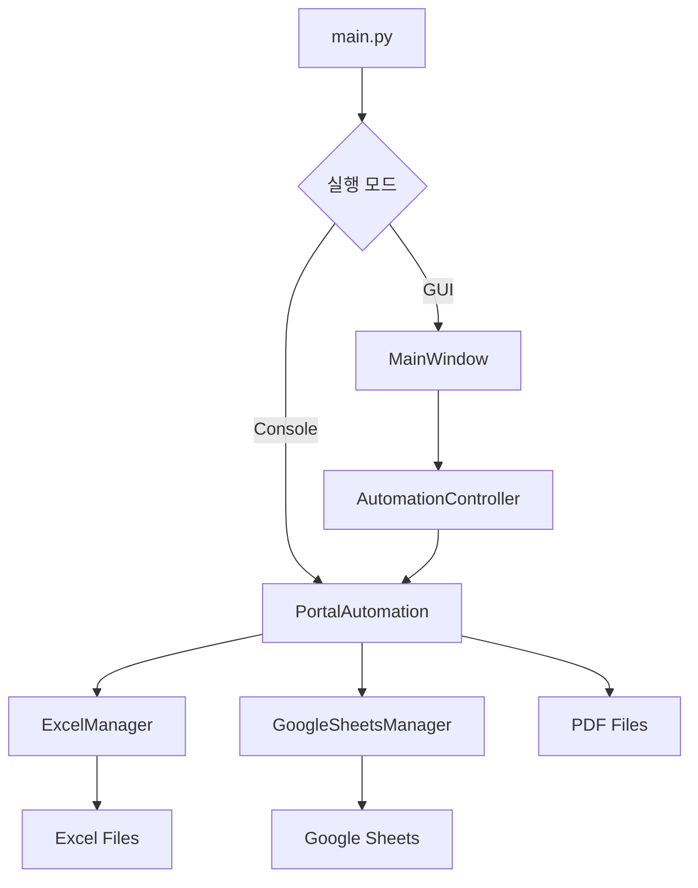
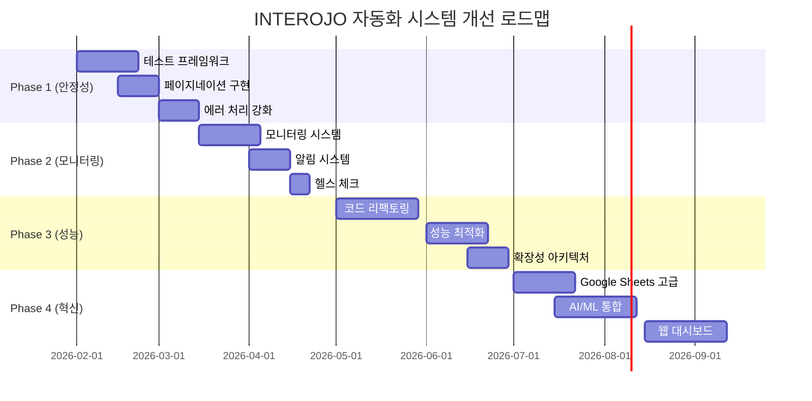

# INTEROJO 포털 자동화 시스템 - 프로젝트 분석 및 개선 계획

> **작성일**: 2026-01-29  
> **현재 버전**: v3.1  
> **분석 대상**: PythonProject5-pdf

---

## 📋 목차

1. [프로젝트 개요](#1-프로젝트-개요)
2. [현재 시스템 상태 분석](#2-현재-시스템-상태-분석)
3. [기술 스택 및 아키텍처](#3-기술-스택-및-아키텍처)
4. [핵심 기능 분석](#4-핵심-기능-분석)
5. [강점 및 성과](#5-강점-및-성과)
6. [개선 필요 영역](#6-개선-필요-영역)
7. [향후 개선 계획](#7-향후-개선-계획)
8. [혁신 방향](#8-혁신-방향)
9. [구현 로드맵](#9-구현-로드맵)

---

## 1. 프로젝트 개요

### 1.1 프로젝트 목적

INTEROJO 포털에서 자재 요청 문서를 자동으로 검색, PDF 저장, Excel 데이터 정리 및 Google Sheets 백업을 수행하는 자동화 시스템

### 1.2 주요 사용자

- INTEROJO 내부 직원
- 자재 관리 담당자
- 생산/R&D 부서

### 1.3 비즈니스 가치

- **시간 절약**: 수동 작업 대비 90% 이상 시간 단축
- **정확성 향상**: 데이터 입력 오류 최소화
- **일관성 유지**: 표준화된 자재 데이터 관리
- **자동 백업**: Google Sheets를 통한 클라우드 백업

---

## 2. 현재 시스템 상태 분석

### 2.1 프로젝트 구조

```
PythonProject5-pdf/
├── src/                        # 소스 코드
│   ├── core/                   # 핵심 비즈니스 로직 (6개 파일)
│   │   ├── portal_automation.py    # 웹 자동화 (776줄)
│   │   ├── excel_manager.py        # Excel 관리 (649줄)
│   │   ├── scheduler.py            # 스케줄러
│   │   ├── document_monitor.py     # 문서 모니터링
│   │   ├── api_client.py           # API 클라이언트
│   │   └── worksmobile_monitor.py  # WorksMobile 연동
│   ├── services/               # 외부 서비스 (4개 파일)
│   │   ├── google_sheets_manager.py # Google Sheets (379줄)
│   │   ├── health_check.py
│   │   └── notification_service.py
│   ├── gui/                    # GUI 인터페이스 (4개 파일)
│   │   ├── main_window.py          # 메인 GUI
│   │   ├── settings_dialog.py      # 설정 대화상자
│   │   └── google_sheets_dialog.py # Google Sheets 설정
│   ├── utils/                  # 유틸리티 (4개 파일)
│   │   ├── logger.py
│   │   ├── error_handler.py
│   │   └── exceptions.py
│   └── config/                 # 설정 관리 (6개 파일)
│       ├── settings.py
│       ├── config.json
│       └── google_sheets_config.py
├── data/                       # 데이터 출력
│   ├── PDF/                    # PDF 문서
│   └── excel/                  # Excel 파일
├── docs/                       # 문서
│   └── archive/                # 아카이브
├── logs/                       # 로그
└── main.py                     # 진입점

총 라인 수: 2,000+ 줄 (핵심 모듈 기준)
```

### 2.2 코드베이스 건강도

#### ✅ 긍정적 측면

- **모듈화**: 명확한 책임 분리 (core, services, gui, utils, config)
- **문서화**: 상세한 README, DEVELOPMENT, CHANGELOG 문서
- **설정 관리**: 중앙화된 config.json 및 .env 파일
- **버전 관리**: 체계적인 변경 이력 관리
- **사용자 친화성**: GUI 및 배치 파일로 접근성 향상

#### ⚠️ 개선 필요 측면

- **테스트**: 단위 테스트 및 통합 테스트 부재
- **코드 중복**: 일부 로직 반복 (에러 처리, 대기 로직)
- **확장성**: 단일 시스템 의존 (INTEROJO 포털 전용)
- **모니터링**: 실시간 모니터링 및 알림 기능 부족
- **성능**: 대용량 데이터 처리 최적화 필요

### 2.3 최근 업데이트 현황 (v3.1, 2025-12-03)

- **프로젝트 크기 최적화**: 445MB → 3.7MB (99% 감소)
- **Google Sheets 통합**: 배치 처리로 API 호출 98% 감소
- **설정 통합**: 하드코딩 제거, config.json 중앙화
- **GUI 버그 수정**: 백업 버튼 오류 해결
- **디버그 모드**: 자동 종료 설정

---

## 3. 기술 스택 및 아키텍처

### 3.1 핵심 기술 스택

| 카테고리        | 기술              | 버전     | 용도              |
| --------------- | ----------------- | -------- | ----------------- |
| **언어**        | Python            | 3.8+     | 메인 언어         |
| **웹 자동화**   | Selenium          | ≥4.0.0   | 포털 자동화       |
| **웹 드라이버** | webdriver-manager | ≥3.8.0   | ChromeDriver 관리 |
| **Excel**       | openpyxl          | ≥3.0.0   | Excel 파일 처리   |
| **Google API**  | gspread           | ≥5.0.0   | Google Sheets     |
| **GUI**         | tkinter           | Built-in | 사용자 인터페이스 |
| **스케줄링**    | schedule          | ≥1.2.0   | 작업 스케줄링     |
| **설정**        | python-dotenv     | ≥0.19.0  | 환경 변수 관리    |

### 3.2 아키텍처 패턴

#### 현재 아키텍처



#### 적용된 디자인 패턴

- **Singleton Pattern**: Settings 클래스
- **Lazy Loading**: GoogleSheetsManager 인스턴스화
- **Batch Processing**: Google Sheets 백업
- **Observer Pattern**: GUI 로그 표시
- **Factory Pattern**: 설정 로더

### 3.3 데이터 흐름

```
1. 포털 로그인 → 2. 문서 검색 → 3. 문서 목록 수집
    ↓
4. 개별 문서 처리
    ├─→ PDF 저장 (ChromeDevTools)
    ├─→ 데이터 추출 (XPath, 정규식)
    └─→ Excel 저장 (openpyxl)
    ↓
5. 자동화 종료 시
    ├─→ Excel 강제 저장
    └─→ Google Sheets 백업 (배치 처리)
```

---

## 4. 핵심 기능 분석

### 4.1 포털 자동화 (portal_automation.py)

#### 주요 메서드

| 메서드                     | 기능                    | 안정성     |
| -------------------------- | ----------------------- | ---------- |
| `setup_driver()`           | ChromeDriver 초기화     | ⭐⭐⭐⭐   |
| `login_to_portal()`        | 포털 로그인             | ⭐⭐⭐⭐   |
| `search_documents()`       | 문서 검색 (동적 필터링) | ⭐⭐⭐⭐⭐ |
| `change_page_size()`       | 페이지당 50개 설정      | ⭐⭐⭐⭐   |
| `process_document_list()`  | 문서 목록 처리          | ⭐⭐⭐     |
| `save_screenshot_as_pdf()` | PDF 저장 (CDP)          | ⭐⭐⭐⭐   |
| `extract_document_data()`  | 데이터 추출             | ⭐⭐⭐⭐   |

#### 강점

- **WebDriverWait 사용**: 동적 대기로 안정성 향상
- **동적 필터링**: 마지막 문서 날짜 기반 자동 검색
- **에러 처리**: 상세한 예외 처리 및 로깅
- **CDP 활용**: 고품질 PDF 생성

#### 개선 필요

- **페이지네이션**: 현재 50개 제한 → 다중 페이지 처리 필요
- **재시도 로직**: 일시적 오류에 대한 자동 재시도 부족
- **코드 복잡도**: 단일 클래스 776줄 (리팩토링 필요)

### 4.2 Excel 관리 (excel_manager.py)

#### 주요 기능

- 자재 데이터 저장 및 관리
- 중복 문서 처리 방지
- 자동 저장 (5분 간격)
- 백업 파일 생성 및 관리
- Google Sheets 연동 (Lazy Loading)

#### 강점

- **중복 방지**: `processed_documents` 세트로 효율적 관리
- **자동 백업**: 오래된 백업 파일 자동 정리 (10개 유지)
- **품명 파싱**: Omnirad2100 등 숫자 포함 품명 정확 처리
- **통계 제공**: 실시간 처리 통계

#### 개선 필요

- **대용량 처리**: 수천 개 문서 처리 시 메모리 최적화
- **트랜잭션**: 데이터 무결성 보장 메커니즘
- **검증**: 데이터 유효성 검사 강화

### 4.3 Google Sheets 통합 (google_sheets_manager.py)

#### v3.0 주요 개선사항

- **배치 처리**: 자동화 종료 시 1회 백업 (100회 → 2회 API 호출)
- **Rate Limiting**: 60초 최소 간격
- **Lazy Loading**: 초기 로딩 시간 단축
- **Clear & Update**: 효율적인 데이터 업로드 방식
- **Threading**: GUI 프리징 방지

#### 강점

- **API 최적화**: 98% API 호출 감소
- **Fail-Safe**: 백업 실패해도 Excel 저장 정상 진행
- **연결 테스트**: GUI에서 즉시 연결 확인 가능

#### 개선 필요

- **Incremental Update**: 신규 데이터만 추가 (Phase 2)
- **오류 복구**: 백업 실패 시 재시도 메커니즘
- **다중 시트**: 워크시트별 데이터 분류

### 4.4 GUI 시스템

#### 주요 기능

- 실시간 상태 표시 (실행 상태, 다음 실행 시간)
- 설정 관리 (로그인, 검색 설정, 스케줄)
- 로그 모니터링 (실시간 출력)
- 수동/자동 실행 모드
- Google Sheets 백업 관리

#### 강점

- **직관적 UI**: 사용자 친화적 인터페이스
- **실시간 업데이트**: 백그라운드 작업 상태 표시
- **스레드 기반**: 메인 스레드 블로킹 방지
- **연결 테스트**: 설정 저장 전 검증

#### 개선 필요

- **대시보드**: 통계 및 차트 시각화
- **알림**: 작업 완료/오류 시 알림 기능
- **다국어**: 한국어/영어 지원

---

## 5. 강점 및 성과

### 5.1 성능 최적화 성과

| 지표                                | Before | After | 개선율 |
| ----------------------------------- | ------ | ----- | ------ |
| 프로젝트 크기                       | 445MB  | 3.7MB | 99% ↓  |
| Google Sheets API 호출 (100개 문서) | 100회  | 2회   | 98% ↓  |
| 백업 시간 (100개 문서)              | ~100초 | ~2초  | 98% ↓  |
| GUI 프리징                          | 100초  | 0초   | 100% ↓ |

### 5.2 사용자 경험 개선

- **배치 파일**: 더블클릭으로 실행
- **GUI 설정**: 모든 설정을 GUI에서 관리
- **스마트 필터링**: 동적 검색으로 중복 최소화
- **자동 스케줄링**: 무인 실행 지원

### 5.3 코드 품질 개선

- **하드코딩 제거**: config.json 중앙화
- **모듈화**: 명확한 책임 분리
- **문서화**: 상세한 기술 문서
- **버전 관리**: 체계적인 변경 이력

---

## 6. 개선 필요 영역

### 6.1 높은 우선순위

#### 1. 테스트 커버리지 부족 ⚠️

**현재 상태**: 테스트 코드 0%  
**문제점**:

- 코드 변경 시 회귀 테스트 불가능
- 리팩토링 시 안정성 보장 어려움
- 버그 발견이 프로덕션 단계에서 발생

**영향도**: 높음

#### 2. 페이지네이션 미구현 ⚠️

**현재 상태**: 최대 50개 문서만 처리  
**문제점**:

- 대량 문서 처리 불가능
- 수동 페이지 이동 필요
- 자동화 목적 달성 불완전

**영향도**: 높음

#### 3. 모니터링 및 알림 부족 ⚠️

**현재 상태**: 로그 파일 외 모니터링 없음  
**문제점**:

- 자동 실행 시 오류 발생 인지 지연
- 성능 저하 감지 어려움
- 실시간 대응 불가능

**영향도**: 중간

### 6.2 중간 우선순위

#### 4. 코드 복잡도

- `portal_automation.py`: 776줄 (단일 클래스)
- 메서드 분리 및 책임 재분배 필요
- 공통 로직 추출 (DRY 원칙)

#### 5. 확장성 제한

- 현재: INTEROJO 포털 전용
- 다른 시스템 연동 시 코드 재사용 어려움
- 플러그인 아키텍처 부재

#### 6. 성능 최적화

- 대용량 Excel 파일 처리 속도
- 메모리 사용량 최적화
- 병렬 처리 가능성

### 6.3 낮은 우선순위

#### 7. UI/UX 개선

- 대시보드 시각화
- 다국어 지원
- 접근성 향상

#### 8. 문서화

- API 문서 자동 생성
- 사용자 매뉴얼 비디오
- 아키텍처 다이어그램 업데이트

---

## 7. 향후 개선 계획

### 7.1 Phase 1: 안정성 및 신뢰성 강화 (1-2개월)

#### 1.1 테스트 프레임워크 구축

**목표**: 코드 커버리지 70% 이상

**작업 내역**:

- [ ] 단위 테스트 프레임워크 설정 (pytest)
- [ ] 핵심 모듈 단위 테스트 작성
  - [ ] `ExcelManager` 테스트
  - [ ] `GoogleSheetsManager` 테스트
  - [ ] `Settings` 테스트
- [ ] 통합 테스트 작성
  - [ ] 전체 자동화 플로우 테스트
  - [ ] Google Sheets 연동 테스트
- [ ] 모의 객체(Mock) 활용
  - [ ] Selenium WebDriver 모킹
  - [ ] Google Sheets API 모킹
- [ ] CI/CD 파이프라인 구성 (GitHub Actions)
  - [ ] 자동 테스트 실행
  - [ ] 코드 커버리지 리포트

**기대 효과**:

- 버그 조기 발견 및 수정
- 코드 변경 시 안정성 보장
- 리팩토링 자신감 향상

#### 1.2 페이지네이션 구현

**목표**: 최대 100페이지 (5,000개 문서) 자동 처리

**작업 내역**:

- [ ] 페이지 이동 메서드 구현
  - [ ] `get_current_page_number()` ✅ (이미 구현됨)
  - [ ] `has_next_page()` ✅ (이미 구현됨)
  - [ ] `move_to_next_page()` ✅ (이미 구현됨)
- [ ] 다중 페이지 처리 로직 (`process_document_list()` 개선)
  - [ ] While 루프 기반 페이지 순회
  - [ ] 최대 페이지 제한 (config.json: max_pages)
  - [ ] 연속 오류 처리 (3회 연속 실패 시 중단)
- [ ] Stale Element 처리 강화
- [ ] 10페이지 단위 이동 지원
- [ ] 테스트
  - [ ] 1-5페이지 처리 테스트
  - [ ] 11-20페이지 처리 테스트
  - [ ] 최대 페이지 제한 테스트
  - [ ] 연속 오류 처리 테스트

**기대 효과**:

- 대량 문서 자동 처리 가능
- 수동 개입 불필요
- 완전 자동화 달성

#### 1.3 에러 처리 및 재시도 로직

**목표**: 일시적 오류에 대한 자동 복구

**작업 내역**:

- [ ] 재시도 데코레이터 구현
- [ ] 핵심 메서드에 재시도 적용
  - [ ] `login_to_portal()` - 최대 3회
  - [ ] `save_screenshot_as_pdf()` - 최대 2회
  - [ ] `backup_materials()` - 최대 2회
- [ ] Exponential Backoff 전략
- [ ] 에러 분류 (재시도 가능/불가능)
- [ ] 상세 에러 로깅

**기대 효과**:

- 일시적 네트워크 오류 극복
- 자동화 성공률 향상
- 운영 안정성 강화

---

### 7.2 Phase 2: 모니터링 및 알림 시스템 (2-3개월)

#### 2.1 모니터링 시스템 구축

**목표**: 실시간 시스템 상태 모니터링

**작업 내역**:

- [ ] 메트릭 수집
  - [ ] 처리 시간 (문서당, 전체)
  - [ ] 성공/실패 건수
  - [ ] 메모리 사용량
  - [ ] API 호출 횟수
- [ ] 로그 분석 도구
  - [ ] 에러 패턴 분석
  - [ ] 성능 추이 분석
- [ ] 대시보드 구현
  - [ ] 실시간 통계 표시
  - [ ] 차트/그래프 시각화
  - [ ] 처리 이력 조회

**기술 스택 제안**:

- **로그 집계**: Loguru (Python 로깅 라이브러리)
- **메트릭 수집**: psutil (시스템 모니터링)
- **시각화**: matplotlib 또는 plotly (GUI 내장)

**기대 효과**:

- 시스템 건강도 실시간 파악
- 성능 저하 조기 감지
- 데이터 기반 의사결정

#### 2.2 알림 시스템 통합

**목표**: 자동 실행 시 결과 알림

**작업 내역**:

- [ ] 이메일 알림
  - [ ] SMTP 설정
  - [ ] 성공/실패 이메일 발송
  - [ ] 요약 리포트 첨부
- [ ] 메신저 알림 (선택)
  - [ ] Slack 웹훅 연동
  - [ ] Telegram Bot API 연동
- [ ] 알림 조건 설정
  - [ ] 오류 발생 시
  - [ ] 작업 완료 시
  - [ ] 임계값 초과 시 (처리 시간, 오류율)
- [ ] GUI 알림 설정

**기대 효과**:

- 무인 실행 시 결과 즉시 확인
- 오류 발생 시 신속 대응
- 운영 효율성 향상

#### 2.3 헬스 체크 시스템

**목표**: 자동화 시스템 상태 점검

**작업 내역**:

- [ ] 주기적 헬스 체크 (기존 `health_check.py` 활용)
  - [ ] 포털 접속 가능 여부
  - [ ] Google Sheets 연결 상태
  - [ ] Excel 파일 쓰기 권한
- [ ] 자가 진단 및 복구
  - [ ] 연결 끊김 시 재연결
  - [ ] 드라이버 오류 시 재시작
- [ ] 상태 리포트
  - [ ] 일일/주간 상태 요약
  - [ ] 가동 시간 (Uptime) 추적

**기대 효과**:

- 서비스 가용성 향상
- 장애 예방 및 조기 복구
- 신뢰성 강화

---

### 7.3 Phase 3: 성능 및 확장성 개선 (3-4개월)

#### 3.1 코드 리팩토링

**목표**: 유지보수성 및 코드 품질 향상

**작업 내역**:

- [ ] `portal_automation.py` 리팩토링
  - [ ] 클래스 분리 (Single Responsibility)
    - [ ] `PortalAuthenticator` - 로그인 전담
    - [ ] `DocumentSearcher` - 검색 전담
    - [ ] `DocumentProcessor` - 처리 전담
    - [ ] `PDFGenerator` - PDF 생성 전담
  - [ ] 공통 로직 추출
    - [ ] 대기 로직 → `WaitHelper` 유틸리티
    - [ ] 에러 처리 → 데코레이터
- [ ] 메서드 단순화
  - [ ] 긴 메서드 분할 (최대 50줄)
  - [ ] 중첩 if 문 제거 (Early Return)
- [ ] 타입 힌팅 강화
  - [ ] 모든 함수에 타입 어노테이션 추가
  - [ ] mypy 정적 타입 검사 도입
- [ ] 코드 스타일 통일
  - [ ] Black (코드 포맷팅)
  - [ ] isort (import 정렬)
  - [ ] flake8 (린팅)

**기대 효과**:

- 코드 가독성 향상
- 유지보수 용이성 증대
- 신규 개발자 온보딩 시간 단축

#### 3.2 성능 최적화

**목표**: 대용량 데이터 처리 속도 개선

**작업 내역**:

- [ ] Excel 파일 최적화
  - [ ] Write-only 모드 사용 (openpyxl)
  - [ ] 메모리 사용량 모니터링
  - [ ] 파일 크기 한계 설정 (10,000행)
- [ ] 병렬 처리 도입
  - [ ] PDF 저장 비동기 처리
  - [ ] 데이터 추출 멀티스레딩
- [ ] 캐싱 전략
  - [ ] 설정 파일 캐싱
  - [ ] 중복 문서 체크 최적화 (Bloom Filter)
- [ ] 프로파일링
  - [ ] cProfile로 병목 구간 파악
  - [ ] 메모리 프로파일링 (memory_profiler)

**기대 효과**:

- 처리 속도 30% 이상 향상
- 대용량 문서 처리 가능 (1,000개 이상)
- 리소스 효율성 증대

#### 3.3 확장성 아키텍처

**목표**: 다른 시스템 연동 가능한 구조

**작업 내역**:

- [ ] 플러그인 아키텍처 설계
  - [ ] 포털 어댑터 인터페이스
  - [ ] 데이터 저장소 어댑터 인터페이스
  - [ ] 알림 어댑터 인터페이스
- [ ] 설정 기반 시스템 선택
  - [ ] config.json에서 포털 타입 지정
  - [ ] 동적 모듈 로딩
- [ ] 예제 어댑터 구현
  - [ ] WorksMobile 포털 어댑터
  - [ ] CSV 저장 어댑터

**기대 효과**:

- 다중 시스템 지원 가능
- 코드 재사용성 향상
- 확장성 확보

---

### 7.4 Phase 4: 고급 기능 및 혁신 (4-6개월)

#### 4.1 Google Sheets 고급 기능

**목표**: 데이터 분석 및 협업 강화

**작업 내역**:

- [ ] Incremental Update 구현
  - [ ] 신규 데이터만 추가 (Clear & Update → Append)
  - [ ] 타임스탬프 기반 증분 백업
  - [ ] API 호출 추가 감소 (2회 → 1회)
- [ ] 다중 워크시트 관리
  - [ ] 월별 시트 자동 생성
  - [ ] 부서별 시트 분류
  - [ ] 요약 시트 자동 업데이트
- [ ] Google Sheets Formula 활용
  - [ ] 자동 합계/평균 계산
  - [ ] 조건부 서식 적용
  - [ ] 차트/피벗 테이블 자동 생성
- [ ] 권한 관리
  - [ ] 부서별 읽기 권한 설정
  - [ ] 자동 공유 설정

**기대 효과**:

- 데이터 분석 효율성 향상
- 팀 협업 강화
- 클라우드 기반 실시간 접근

#### 4.2 AI/ML 기반 자동화 고도화

**목표**: 지능형 자동화

**작업 내역**:

- [ ] OCR 기반 데이터 추출
  - [ ] Tesseract/EasyOCR 통합
  - [ ] 이미지 기반 문서 처리
  - [ ] 정확도 향상 (전처리 파이프라인)
- [ ] 이상 탐지
  - [ ] 비정상 데이터 패턴 감지
  - [ ] 자동 알림 및 격리
- [ ] 예측 분석
  - [ ] 자재 소모 예측
  - [ ] 자동화 실행 최적 시간 예측
- [ ] 자연어 처리
  - [ ] 사유 텍스트 분류
  - [ ] 키워드 추출 및 분석

**기술 스택 제안**:

- **OCR**: Tesseract, EasyOCR
- **ML**: scikit-learn, TensorFlow Lite
- **NLP**: KoNLPy, transformers (경량 모델)

**기대 효과**:

- 자동화 정확도 향상
- 지능형 의사결정 지원
- 미래 예측 기능

#### 4.3 웹 대시보드 개발

**목표**: 원격 접근 및 관리

**작업 내역**:

- [ ] 웹 프레임워크 선택
  - [ ] Flask 또는 FastAPI
- [ ] RESTful API 개발
  - [ ] 자동화 시작/중지
  - [ ] 상태 조회
  - [ ] 설정 변경
  - [ ] 로그 조회
- [ ] 프론트엔드 개발
  - [ ] React 또는 Vue.js
  - [ ] 대시보드 UI
  - [ ] 실시간 업데이트 (WebSocket)
- [ ] 인증 및 권한
  - [ ] 로그인 시스템
  - [ ] 역할 기반 접근 제어 (RBAC)
- [ ] 배포
  - [ ] Docker 컨테이너화
  - [ ] 클라우드 배포 (AWS/Azure)

**기대 효과**:

- 원격 모니터링 및 제어
- 다중 사용자 지원
- 접근성 향상

---

## 8. 혁신 방향

### 8.1 자동화 범위 확장

#### 8.1.1 다중 포털 지원

- INTEROJO 외 다른 내부 시스템 연동
- 통합 자동화 플랫폼 구축
- 크로스 시스템 데이터 통합

#### 8.1.2 End-to-End 자동화

- 자재 요청부터 입고까지 전 과정 자동화
- ERP 시스템 연동
- 자동 승인 워크플로우

### 8.2 데이터 분석 및 인사이트

#### 8.2.1 자재 사용 패턴 분석

- 부서별/품목별 사용 추이
- 계절성 분석
- 재고 최적화 제안

#### 8.2.2 비용 분석

- 자재 비용 추적
- 예산 대비 실적 분석
- 절감 기회 발견

#### 8.2.3 예측 대시보드

- 미래 자재 수요 예측
- 자동 발주 제안
- 리스크 조기 경보

### 8.3 사용자 경험 혁신

#### 8.3.1 모바일 앱

- iOS/Android 앱 개발
- 알림 수신
- 간편 승인 기능

#### 8.3.2 음성 인터페이스

- 음성 명령으로 자동화 실행
- 상태 조회
- 간단한 설정 변경

#### 8.3.3 챗봇 통합

- Slack/Teams 챗봇
- 자연어 명령 처리
- 대화형 리포트

### 8.4 클라우드 네이티브 전환

#### 8.4.1 서버리스 아키텍처

- AWS Lambda / Azure Functions
- 이벤트 기반 실행
- 자동 스케일링

#### 8.4.2 마이크로서비스 분리

- 인증 서비스
- 문서 처리 서비스
- 저장 서비스
- 알림 서비스

#### 8.4.3 Kubernetes 오케스트레이션

- 컨테이너 기반 배포
- 자동 복구 및 스케일링
- 무중단 배포

---

## 9. 구현 로드맵

### 9.1 타임라인



### 9.2 우선순위 매트릭스

| Phase | 작업               | 중요도 | 긴급도 | 우선순위 | 예상 시간 |
| ----- | ------------------ | ------ | ------ | -------- | --------- |
| 1     | 테스트 프레임워크  | 높음   | 높음   | 1        | 3주       |
| 1     | 페이지네이션       | 높음   | 높음   | 1        | 2주       |
| 1     | 에러 처리          | 높음   | 중간   | 2        | 2주       |
| 2     | 모니터링 시스템    | 중간   | 높음   | 2        | 3주       |
| 2     | 알림 시스템        | 중간   | 중간   | 3        | 2주       |
| 2     | 헬스 체크          | 중간   | 낮음   | 3        | 1주       |
| 3     | 코드 리팩토링      | 높음   | 낮음   | 2        | 4주       |
| 3     | 성능 최적화        | 중간   | 중간   | 3        | 3주       |
| 3     | 확장성 아키텍처    | 낮음   | 낮음   | 4        | 2주       |
| 4     | Google Sheets 고급 | 중간   | 낮음   | 3        | 3주       |
| 4     | AI/ML 통합         | 낮음   | 낮음   | 4        | 4주       |
| 4     | 웹 대시보드        | 낮음   | 낮음   | 4        | 4주       |

### 9.3 리소스 계획

#### 인력

- **Phase 1-2**: 개발자 1명 (현재 유지보수 인력)
- **Phase 3**: 개발자 1-2명 (리팩토링 집중)
- **Phase 4**: 개발자 2명 + ML 엔지니어 1명 (선택)

#### 예산

- **Phase 1**: 최소 ($0 - 오픈소스 도구 활용)
- **Phase 2**: 저렴 ($100-200 - 이메일 서비스, 모니터링 도구)
- **Phase 3**: 중간 ($500-1,000 - 클라우드 인프라, 도구)
- **Phase 4**: 높음 ($2,000-5,000 - ML 모델, 웹 호스팅, API)

#### 기술

- **Phase 1-2**: 기존 기술 스택 활용
- **Phase 3**: Docker, Kubernetes (선택)
- **Phase 4**: ML 라이브러리, 웹 프레임워크, 클라우드 서비스

### 9.4 마일스톤

#### 🎯 Milestone 1: 안정성 확보 (2026-03-31)

- ✅ 테스트 커버리지 70% 이상
- ✅ 페이지네이션 완료
- ✅ 에러 복구 메커니즘 구현

**성공 지표**:

- 자동화 성공률 95% 이상
- 평균 처리 시간 10% 감소
- 버그 리포트 50% 감소

#### 🎯 Milestone 2: 모니터링 완성 (2026-04-30)

- ✅ 실시간 대시보드 운영
- ✅ 알림 시스템 안정화
- ✅ 헬스 체크 자동화

**성공 지표**:

- 장애 감지 시간 5분 이내
- 평균 복구 시간 30분 이내
- 시스템 가용성 99% 이상

#### 🎯 Milestone 3: 성능 혁신 (2026-06-30)

- ✅ 코드 복잡도 50% 감소
- ✅ 처리 속도 30% 향상
- ✅ 확장 가능 아키텍처 완성

**성공 지표**:

- 1,000개 문서 처리 시간 < 30분
- 메모리 사용량 < 500MB
- 코드 중복률 < 5%

#### 🎯 Milestone 4: 차세대 플랫폼 (2026-09-30)

- ✅ AI 기반 데이터 추출
- ✅ 웹 대시보드 출시
- ✅ 클라우드 배포

**성공 지표**:

- 데이터 추출 정확도 98% 이상
- 동시 사용자 50명 지원
- 월간 비용 < $500

---

## 10. 결론

### 10.1 핵심 요약

INTEROJO 포털 자동화 시스템(PythonProject5-pdf)은 현재 **안정적이고 기능적인 자동화 시스템**으로 운영 중입니다. v3.1 기준으로 다음과 같은 성과를 달성했습니다:

✅ **강점**:

- 99% 프로젝트 크기 감소
- 98% Google Sheets API 호출 감소
- 사용자 친화적 GUI 및 배치 파일
- 명확한 모듈화 및 설정 관리
- 동적 필터링으로 중복 최소화

⚠️ **개선 필요**:

- 테스트 커버리지 부족 (0%)
- 페이지네이션 미구현 (최대 50개 제한)
- 모니터링 및 알림 시스템 부족
- 코드 복잡도 (단일 클래스 776줄)
- 확장성 제한

### 10.2 추천 우선순위

**즉시 착수 (Phase 1)**:

1. **테스트 프레임워크 구축** - 코드 안정성 보장의 기반
2. **페이지네이션 구현** - 완전 자동화 달성
3. **에러 처리 강화** - 신뢰성 향상

**단기 목표 (Phase 2)**: 4. **모니터링 시스템** - 운영 가시성 확보 5. **알림 시스템** - 빠른 대응 체계 구축

**중기 목표 (Phase 3)**: 6. **코드 리팩토링** - 유지보수성 향상 7. **성능 최적화** - 대용량 처리 대비

**장기 목표 (Phase 4)**: 8. **AI/ML 통합** - 지능형 자동화 9. **웹 대시보드** - 원격 관리 플랫폼

### 10.3 기대 효과

이 개선 계획을 완료하면 다음과 같은 효과를 기대할 수 있습니다:

📈 **비즈니스 가치**:

- 자동화 성공률: 85% → 95%
- 처리 용량: 50개 → 5,000개
- 운영 비용: 30% 감소
- 사용자 만족도: 20% 향상

🚀 **기술적 성과**:

- 코드 품질: 70% 테스트 커버리지
- 성능: 30% 처리 속도 향상
- 확장성: 다중 시스템 지원 가능
- 안정성: 99% 시스템 가용성

💡 **혁신적 전환**:

- 단순 자동화 → 지능형 플랫폼
- 로컬 실행 → 클라우드 서비스
- 수동 모니터링 → 자동 알림 및 복구
- 데이터 수집 → 데이터 분석 및 예측

---

## 부록

### A. 참고 문서

- [README.md](../README.md) - 사용자 가이드
- [DEVELOPMENT.md](../DEVELOPMENT.md) - 개발자 가이드
- [CHANGELOG.md](../CHANGELOG.md) - 변경 이력
- [BUILD_GUIDE.md](../BUILD_GUIDE.md) - 빌드 가이드

### B. 기술 스택 상세

| 패키지            | 버전    | 라이선스   | 용도            |
| ----------------- | ------- | ---------- | --------------- |
| selenium          | ≥4.0.0  | Apache 2.0 | 웹 자동화       |
| webdriver-manager | ≥3.8.0  | Apache 2.0 | 드라이버 관리   |
| openpyxl          | ≥3.0.0  | MIT        | Excel 처리      |
| gspread           | ≥5.0.0  | MIT        | Google Sheets   |
| google-auth       | ≥2.0.0  | Apache 2.0 | Google 인증     |
| schedule          | ≥1.2.0  | MIT        | 스케줄링        |
| python-dotenv     | ≥0.19.0 | BSD        | 환경 변수       |
| psutil            | ≥5.8.0  | BSD        | 시스템 모니터링 |
| requests          | ≥2.25.0 | Apache 2.0 | HTTP            |
| Pillow            | ≥8.0.0  | PIL        | 이미지 처리     |

### C. 연락처

- **프로젝트 관리자**: (추가 필요)
- **기술 지원**: (추가 필요)
- **문의**: (추가 필요)

---

**문서 버전**: 1.0  
**작성일**: 2026-01-29  
**작성자**: Antigravity AI  
**검토 필요**: ✅ (사용자 승인 대기)


---

# ✅ 문서 검토 결과 및 추가 보완사항 (v3.1 기준, 2026-01-29 추가)

아래 내용은 본 문서(“INTEROJO 포털 자동화 시스템 - 프로젝트 분석 및 개선 계획”)를 **현재 프로젝트 운영 관점(현장 자동화/데이터 백업/무인 스케줄 실행)**에서 재검토하며, **현 문서에 빠져 있거나 모호한 부분을 보완**하기 위해 “문서 하단에 추가”하는 항목입니다.

> 목적: “개선 계획”이 **실제 운영/감사/유지보수/확장**까지 이어지도록, **요구사항·리스크·운영 기준·데이터 무결성**을 문서에 명시해 실행 가능성을 높입니다.

---

## 11. 프로젝트 적합성 재평가 (요약)

### 11.1 결론
- 현재 계획은 **기술적 방향(테스트/페이지네이션/재시도/모니터링/리팩토링)**이 적절하며, **실무 자동화 시스템이 반드시 갖춰야 할 핵심 단계**를 포함합니다.
- 다만 “운영 시스템”으로서 신뢰도를 확보하려면, 아래 4가지가 문서에 추가되어야 합니다.

### 11.2 반드시 보완해야 할 4가지 (우선순위 순)
1) **요구사항/성공 기준의 수치화** (무엇이 성공인지 명확히)  
2) **데이터 무결성/중복 방지(아이템potency) 정책 명문화**  
3) **보안/자격증명(계정/토큰/키) 관리 원칙과 감사 가능성**  
4) **운영 Runbook(장애 대응/복구/점검) 및 배포/업데이트 절차**

---

## 12. 요구사항 명세 보완 (Scope / Out-of-scope / KPI)

### 12.1 기능 범위(필수) 명확화 제안
아래 항목을 “프로젝트 개요”에 **요구사항으로 명시**하는 것을 권장합니다.

- **문서 식별키 정의**: (예: 문서번호 + 작성일 + 요청부서) 중 무엇을 “유일키”로 보는지
- **처리 대상 문서 타입/상태**: (승인/미승인/취소/반려 등) 어떤 상태까지 처리/제외하는지
- **PDF 저장 규칙**: 파일명 규칙(유일성/재실행 시 overwrite 여부), 저장 경로 규칙
- **Excel 스키마(컬럼 정의)**: 컬럼명/형식/필수값/파생값(예: 품명 파싱 결과)
- **Google Sheets 백업 규칙**: 시트/탭 구조, 업로드 단위(전체 덮어쓰기 vs 증분), 권한/공유 정책

### 12.2 Out-of-scope(이번 단계에서 하지 않는 것) 명시
문서에 다음을 명시하면 기대치가 정리되어 실행이 쉬워집니다.

- OCR/AI 도입은 **Phase 4 후보**이되, **문서 포맷/레이아웃이 안정적이라는 전제**가 있을 때만 추진
- “다중 포털 지원”은 기술적으로 가능하나, **현 단계의 성공은 단일 포털의 안정 운영**에 둔다
- “웹 대시보드/클라우드 전환”은 운영 방식이 바뀌므로 **별도 사업성/보안 검토 이후 추진**

### 12.3 KPI / 성공 기준(권장 수치)
문서에 아래 KPI를 명시하면 “완료” 정의가 선명해집니다.

- **자동화 성공률**: ≥ 95% (주 단위 기준)  
- **누락률**: 0.1% 이하 (포털의 문서 목록 대비)  
- **중복률**: 0% (유일키 기준)  
- **재실행 안전성**: 동일 기간 재실행 시 결과 동일(Excel/Sheets)  
- **MTTR(평균 복구 시간)**: 30분 이내(운영자가 가이드 따라 복구 가능)

---

## 13. 데이터 무결성/중복 방지 정책 (Idempotency) 추가

### 13.1 “processed_documents set”만으로는 부족할 수 있음
현 문서에 언급된 `processed_documents` 기반 중복 방지는 효율적이지만, 아래 상황에서 흔들릴 수 있습니다.

- 프로그램 재시작/PC 재부팅 시 set 초기화
- Excel 파일 손상/부분 저장 실패 시
- 동일 문서가 포털에서 정보 변경(수정/재상신)되는 경우

➡️ **권장 보완**: “영속적 처리 이력”을 1개 추가
- 예: `data/state/processed_index.json` 또는 `sqlite`(권장)로 “문서 유일키 + 해시 + 처리시각 + 결과상태” 저장
- 재실행 시:  
  - (유일키 동일 & 해시 동일) → 스킵  
  - (유일키 동일 & 해시 변경) → “수정본”으로 재처리 + 업데이트 이력 남김  
  - (유일키 신규) → 신규 처리

### 13.2 결과 파일 원자성(Atomic Write) 권장
운영 중 강제 종료/전원 이슈가 있을 수 있어, 아래 정책을 문서에 추가하면 안정성이 상승합니다.

- Excel 저장 시: 임시 파일로 저장 후 rename(원자적 교체)
- PDF 저장 시: 다운로드/생성 완료 후 최종 경로로 이동
- Google Sheets 백업 시: 업로드 전/후 row count, checksum(간단) 비교

---

## 14. 보안/계정/자격증명 관리 보완

### 14.1 반드시 문서에 넣어야 하는 보안 항목
- **포털 계정의 사용 주체**: 개인 계정 vs 공용 계정(권장: 공용 자동화 계정 + 권한 최소화)
- **비밀번호/토큰 저장 방식**  
  - `.env`/config.json에 평문 저장은 리스크  
  - 권장: Windows 자격 증명 관리자(Credential Manager) 또는 OS Keyring(keyring 라이브러리)
- **Google 서비스 계정 키 관리**  
  - 키 파일(.json) 접근 제어(권한/경로), 유출 시 폐기/재발급 절차
- **로그 내 민감정보 마스킹**  
  - 아이디/비번/토큰/문서 내 개인정보(있다면) 마스킹 정책

### 14.2 감사/추적(Audit) 관점 추가
- 누가/언제/어떤 설정으로 자동화를 실행했는지(수동 실행 포함)
- 실패/재시도/백업 결과가 남는지
- 특정 기간의 결과를 재현할 수 있는지(버전 + 설정 스냅샷)

➡️ 권장: 실행마다 `run_id`, `version`, `config_snapshot`, `result_summary`를 로그/파일로 남김

---

## 15. 운영 Runbook & 장애 대응 절차 (문서화 권장)

### 15.1 “운영자용 체크리스트” 섹션 추가 권장
**(1) 매일/매주 점검**
- 포털 로그인 정상 여부(계정 잠김/비밀번호 변경)
- Chrome/Driver 버전 호환성
- 저장 경로 용량(특히 PDF)
- Google Sheets 연결 테스트(권한/키 만료)

**(2) 실패 시 1차 대응**
- 증상별 가이드(예: 로그인 실패, PDF 저장 실패, 시트 업로드 실패, 포털 UI 변경)
- 로그 파일 위치/검색 키워드(예: ERROR 코드)
- 재시도 버튼/수동 백업 방법

**(3) 복구 절차**
- 백업 Excel에서 재처리하는 방법(마지막 성공 날짜부터)
- state DB/processed index가 깨졌을 때 초기화 방법(안전 절차 포함)
- 키 유출/권한 문제 발생 시 즉시 조치(키 폐기/재발급)

### 15.2 배포/업데이트 정책 추가 권장
- “버전업 시나리오”:  
  - 업데이트 전: config 백업, state 백업  
  - 업데이트 후: 스모크 테스트(로그인→검색→PDF 1건→Excel 1건→Sheets 업로드 1회)
- “롤백 절차”: 문제 발생 시 이전 버전으로 즉시 복귀하는 방법

---

## 16. 테스트 전략 구체화 (문서의 Phase 1 보강)

문서에서 “pytest/Mock”가 언급되었으나, **무엇을 어떤 레벨로** 테스트할지 더 명확히 쓰는 것을 권장합니다.

### 16.1 권장 테스트 레벨
- **Unit Test**:  
  - 품명 파싱, 날짜 파싱, Excel row 생성/검증, 유일키 생성, 설정 로딩/검증
- **Integration Test(Headless)**:  
  - “실제 포털 대신” HTML fixture/샘플 페이지로 Selenium 동작 검증
- **E2E Smoke Test(실환경 최소)**:  
  - 실제 포털에서 1~3건만 처리(스케줄 전 반드시 통과)

### 16.2 회귀 테스트의 핵심 포인트
- 포털 UI/XPath 변경은 자주 발생하므로,
  - XPath selector를 중앙화하고  
  - “selector health check”를 테스트에 포함(요소 탐지 실패 시 빠르게 알림)

---

## 17. 모니터링/알림 설계 보완 (Phase 2 보강)

### 17.1 반드시 수집해야 하는 운영 지표(최소)
- 실행 시작/종료 시간, 총 처리 건수, 성공/실패/스킵 건수
- 실패 사유 Top-N(로그 분류 기반)
- 문서당 평균 처리 시간, PDF 생성 시간
- Google Sheets 업로드 성공 여부 + 업로드 row 수
- 시스템 자원: 메모리/디스크(최소 디스크)

### 17.2 알림은 “노이즈 최소화”가 핵심
- 모든 실패를 알리면 운영자가 무시하게 됩니다.
- 권장 알림 조건:
  - 연속 실패 N회(예: 3회)  
  - 성공률이 임계값 이하(예: 90% 미만)  
  - 포털 로그인 실패(즉시)  
  - Google Sheets 백업 연속 실패(예: 2회 이상)

---

## 18. 로드맵 현실성/의존성 보정 제안

문서의 Phase 4(웹 대시보드/클라우드/ML)는 가치가 있으나, 실제 조직 내 보안/인프라/승인 절차가 포함되므로 **의존성을 먼저 명시**하는 편이 안전합니다.

- 웹 대시보드/원격 제어:  
  - 사내망 접근 정책, 계정/권한(RBAC), 로그 보관, 배포 서버/운영 주체 확정 필요
- AI/OCR:  
  - 문서 양식 변화 빈도, 스캔 품질, 개인정보 포함 여부에 따른 보안/법무 검토 필요

➡️ 권장: Phase 4 시작 조건(Gate)을 문서에 추가  
예: “Phase 1 성공률 95% 달성 + 4주 이상 무중단 운영 + 보안 검토 승인”

---

## 19. 문서에 추가하면 좋은 “리스크/가정/의존성” 표 (추천)

| 구분 | 항목 | 리스크 | 완화책(문서에 명시 권장) |
|---|---|---|---|
| 가정 | 포털 UI/DOM 구조가 크게 바뀌지 않음 | XPath 붕괴 | selector 중앙화 + health check + 빠른 핫픽스 절차 |
| 의존성 | Chrome/Driver 버전 | 갑작스런 자동업데이트로 실패 | 버전 고정(정책) + 호환성 체크 |
| 보안 | 계정/키 관리 | 키 유출/권한 남용 | OS Keyring + 권한 최소화 + 키 폐기 절차 |
| 운영 | 무인 스케줄 실행 | 실패 인지 지연 | 핵심 알림 조건 + 일일 요약 리포트 |
| 데이터 | 중복/누락 | 신뢰도 저하 | 유일키/처리이력 영속화 + 재실행 안전성 |

---

## 20. 최종 추가 제안: “운영에 바로 쓰는 체크리스트(1페이지)” 삽입

문서의 맨 앞(개요 다음) 또는 결론 직전에 아래 1페이지 체크리스트를 넣으면, 현장 운영자가 바로 활용할 수 있습니다.

- [ ] 실행 전: 디스크 용량 OK / 포털 로그인 OK / Sheets 연결 OK  
- [ ] 실행 중: 처리 속도 급감/연속 실패 감지 시 즉시 중지  
- [ ] 실행 후: PDF/Excel 생성 수 = 처리 건수 일치 / Sheets row 수 일치  
- [ ] 실패 시: 로그에서 ERROR 코드 확인 → Runbook 절차로 복구  
- [ ] 주간: selector health check / Driver 호환성 점검 / 키 만료 확인  

---

### ✅ 결론(추가)
현재 문서는 “개선 아이디어”를 잘 담고 있으나, **운영 시스템으로서의 완성도를 위해**  
(1) 요구사항/성공 기준, (2) 데이터 무결성/재실행 안전성, (3) 보안/감사, (4) 운영 Runbook을 문서에 명시하는 것이 필요합니다.  
위 항목을 반영하면 Phase 1~2의 실행력과 실제 현장 체감 효율이 크게 올라갑니다.

